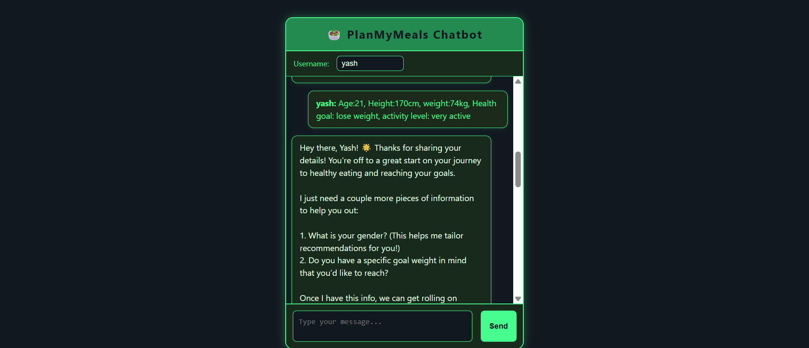
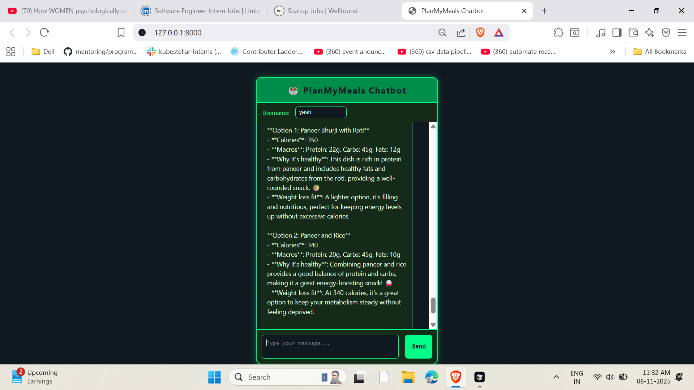
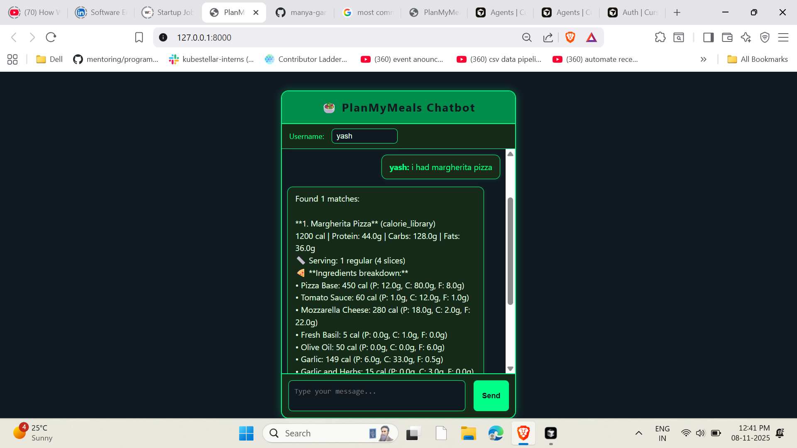

# PlanMyMeals 🍽️  
An AI-powered nutrition assistant system built with **LangGraph**, **FastAPI**, and **OpenAI GPT-4**, helping users create personalized meal plans and track their daily nutrition intake via a smart **Conversation Agent**.

## 🖼️ Preview: PlanMyMeals – Meal Logging and Personalized Planning


### 1. User Logging  
_Users can easily enter their personal details and dietary preferences to set up a personalized profile, enabling tailored meal planning and accurate tracking._



---

### 2. Meal Planning  
_Meal plans are intelligently generated based on the user’s profile, preferences, and nutritional goals to support healthy and goal-oriented eating._



---

### 3. Meal Tracking  
_Users can track their daily meals effortlessly, with helpful feedback that keeps them aligned with their nutrition goals and progress._



---

## Tech Stack

- **Backend**: FastAPI  
- **AI Agents**: LangGraph + OpenAI GPT-4  
- **Interface**:  HTML-based (`index.html`)  
- **Storage**: CSV-based Food & Recipe Databases


---


## System Stats & Data Overview

- **12 states** (as defined in the system's state machine)
- **4 specialized agents**: Conversation, Manager, Meal Plan, Meal Track
- **35+ structured JSON parameters** (across 3 config files)
- **3 configuration files**: `user_info`, `task_info`, `meal_log`
- **600+ food entries from 2 comprehensive databases**: Calorie Library & Indian Recipes


---

## 🌟 Features

###  Multi-Agent AI System
- **Conversation Agent**: Manages all user interactions through a dynamic chat interface.
- **Manager Agent**: Coordinates between specialized agents.
- **Meal Plan Agent**: Generates custom meal plans using extensive food data.
- **Meal Track Agent**: Records and evaluates nutritional intake based on user logs.

### Comprehensive Nutrition Management
- **Smart Food Database**: 600+ food items with detailed nutrition info.
- **Indian Recipes Database**: Macros calculated for traditional recipes.
- **Calorie & Macro Calculation**: Includes BMR, TDEE, and dynamic daily targets.
- **Progress Tracking**: Meal-wise and day-wise insights.

### Intelligent Food Recognition
- **Semantic Food Matching**: Understands food entries from natural language.
- **Fuzzy Database Search**: Flexible and accurate food lookups.
- **Manual Entry**: Add custom foods with macros.

###  Personalized Recommendations
- **Goal-Based Meal Plans**: Tailored for weight loss, gain, or maintenance.
- **Dietary Filters**: Vegetarian, vegan, and allergy-aware meal planning.
- **Activity Integration**: Adjusts plan based on user lifestyle levels.

---


## 🚀 Quick Start

### Prerequisites
- Python 3.8+
- OpenAI API Key

### 🔧 Installation

1. **Clone the repository**
   ```bash
   git clone https://github.com/manya-gangoli/PlanMyMeals.git
   cd PlanMyMeals
   ```

2. **Install dependencies**
   ```bash
   pip install -r requirements.txt
   ```

3. **Set up environment variables**
   ```bash
   echo "OPENAI_API_KEY=your-openai-api-key-here" > .env
   ```


4. **Add Food Databases (Private)**
   - `calorie_library.csv` – Place in root folder *(this file is privately curated and **won’t be made publicly available**)*
   - `indian_recipes.csv` – Place in root folder *(this file is privately curated and **won’t be made publicly available`)*

  ⚠️ **Note:** The CSV data files are **proprietary**, compiled through personal research and are **not included** in the public repository. To maintain privacy and data integrity, users must source or compile their own food and recipe databases for full functionality.


5. **Run the application**

   **Option A: FastAPI Server (Recommended)**
   ```bash
   python PlanMyMealsServer.py
   ```
   > Server available at: `http://localhost:8000`

   **Option B: Command-Line Interface**
   ```bash
   python main.py
   ```

---

## 📱 Web Interface

### 🔗 Interactive Chat Interface  
Accessible at:  
`http://localhost:8000/static/index.html`  


---


## Contributing
Feel free to fork, improve, and create pull requests. Contributions are welcome!

---

##  Contact
For any doubts or collaboration requests, feel free to reach out via GitHub Issues.
